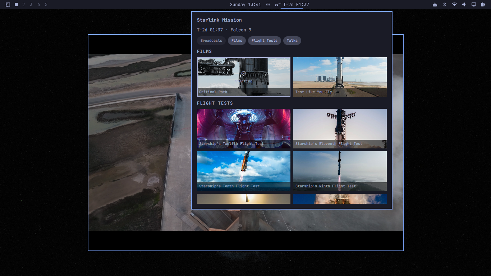

# Omarchy SpaceX TV

An Omarchy bar widget for watching SpaceX broadcasts and Starship films.



It loads the hosted SpaceX TV cache (no X API Bearer Token required), shows poster cards for playable X broadcasts and Starship films, and displays a next-launch countdown from the same SpaceX feeds used by spacex.com/launches. Selecting a card plays its HLS or MP4 stream in `mpv`.

The plugin runs inside the long-lived `omarchy-shell` process. It does not start a second Quickshell process.

## Install

```sh
omarchy plugin add https://github.com/sighmon/omarchy-spacex-tv.git --enable
```

Or copy this folder to `~/.config/omarchy/plugins/com.sighmon.spacex-tv/` and run `omarchy-shell shell rescanPlugins`.

## Usage

Click the bar countdown (or **SpaceX TV**) to open the poster panel. Click a card to play it in `mpv`. Press Escape to close the panel.

After copying files onto a running desktop, **restart the shell**. `omarchy-shell` keeps compiled QML in memory, so `rsync` and `omarchy-shell shell rescanPlugins` leave the previous panel running:

```sh
omarchy-restart-shell
```

## Configure

```sh
omarchy bar move com.sighmon.spacex-tv --section center
omarchy bar set com.sighmon.spacex-tv showCountdown false --json
```

`showCountdown` (default `true`) shows the next-launch countdown next to the SpaceX mark on the bar. When it is off, the bar shows only the icon; hover still shows the countdown, and the panel still shows it. Right-click the bar icon to toggle.

Playback uses `mpv`. Install it if it is not already on the system (`xdg-open` is not used unless you change `Play.js`).

## Remove

```sh
omarchy plugin remove com.sighmon.spacex-tv
```

## Discovery

Default discovery is `https://www.sighmon.com/spacex-tv/x-cache.json` (`processed_cards`, pinned/timeline posts, and `starship_*` playlist snapshots). Next launch comes from:

- `https://content.spacex.com/api/spacex-website/launches-page-tiles/upcoming`
- `https://sxcontent9668.azureedge.us/cms-assets/future_missions.json`

## Logs

Plugin `console.log` lines are prefixed `[SpaceX TV]` and go to the Omarchy shell log:

```sh
qs log -p "$OMARCHY_PATH/shell" --tail 100
```

If `qs` is not on your PATH:

```sh
journalctl --user -f | grep -i "SpaceX TV"
```

## Tests

```sh
node --test tests/test_spacex_tv.js
```

## Links

- [SpaceX TV for AppleTV/iPad on GitHub](https://github.com/sighmon/SpaceX-TV)
- [SpaceX TV on the AppleTV App Store](https://apps.apple.com/us/app/space-tv/id6772833511)
- [SpaceX TV website](https://sighmon.com/spacex-tv/)
